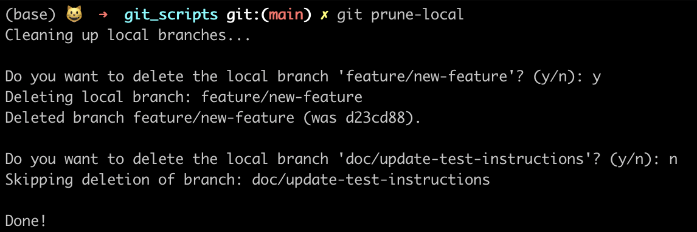

# Git Scripts

This repo contains git scripts that I use in my development workflow

## Setup instructions

- Pull this repo
- Add the path to `git_scripts` to `PATH` by adding the following line to your shell config, e.g. `~/.bashrc` or `~/.zhsrc`

```sh
export PATH="$PATH:path/to/git_scripts"
```

## Commands

### `git prune-local`

This command prunes local branches if they have already been deleted from remote.


